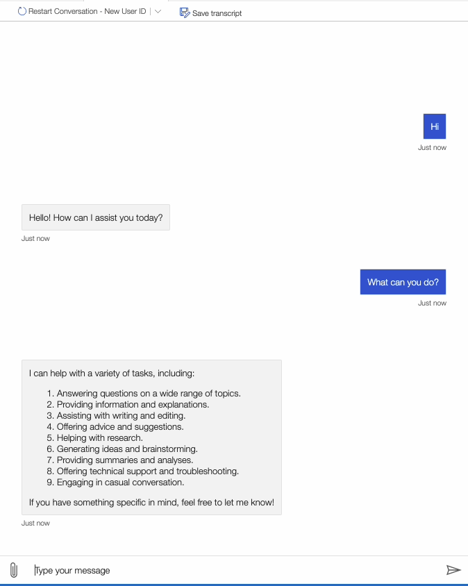

# Teams LangGraph Bot

An intelligent conversational bot for Microsoft Teams powered by LangGraph and Azure OpenAI. This bot demonstrates advanced conversation management with context awareness and memory persistence.

**🎯 Key Features:**
- **Context-Aware Conversations**: Remembers chat history across multiple turns
- **LangGraph Integration**: Advanced conversation flow management
- **Azure OpenAI Powered**: Natural language understanding and generation
- **Teams AI Framework**: Seamless Microsoft Teams integration

**📖 Tutorial**: Read our comprehensive Medium blog post: [Building an AI Microsoft Teams Bot with LangGraph and Azure OpenAI](https://medium.com/@tu.my.doan/building-an-ai-microsoft-teams-bot-with-langgraph-and-azure-openai-bb8bf2270c1d)

<!-- @import "[TOC]" {cmd="toc" depthFrom=1 depthTo=6 orderedList=false} -->

<!-- code_chunk_output -->

- [Teams LangGraph Bot](#teams-langgraph-bot)
  - [Running the LangGraph Bot](#running-the-langgraph-bot)
  - [Interacting with the bot](#interacting-with-the-bot)
  - [Setting up the example](#setting-up-the-example)
  - [Running the example](#running-the-example)
  - [Using Teams Toolkit for Visual Studio Code](#using-teams-toolkit-for-visual-studio-code)

<!-- /code_chunk_output -->

## Running the LangGraph Bot

1. **Install dependencies:**
   ```bash
   poetry install
   ```

2. **Configure environment variables:**
   ```bash
   cp sample.env env/.env
   # Edit env/.env with your Azure OpenAI credentials
   ```

3. **Start the LangGraph bot:**
   ```bash
   poetry run python src/app_langgraph.py
   ```

4. **Test with Bot Framework Emulator:**
   - Connect to `http://localhost:3978/api/messages`
   - Leave App ID and Password empty for local testing


## Interacting with the bot

You can interact with the bot by messaging it.



## Setting up the example

1. Clone the repository

   ```bash
   git clone https://github.com/doantumy/teams-bot-langgraph
   ```

2. Duplicate the `sample.env` in the `teams-bot-langgraph` folder. Rename the file to `.env`.

3. Setting values for environment variable in `.env` for AzureOpenAI: `AZURE_OPENAI_KEY`, `AZURE_OPENAI_ENDPOINT`, `AZURE_OPENAI_API_VERSION`.

4. Update `config.json` in `prompts/tools` with your model deployment name.

## Running the example

The easiest and fastest way to get up and running is with Teams Toolkit as your development guide. To use Teams Toolkit to automate setup and debugging, please [continue below](#using-teams-toolkit-for-visual-studio-code).

Otherwise, if you only want to run the bot locally and build manually, please checkout the [BotFramework Emulator](https://learn.microsoft.com/en-us/azure/bot-service/bot-service-debug-emulator?view=azure-bot-service-4.0&tabs=csharp) from Microsoft.


## Using Teams Toolkit for Visual Studio Code

The simplest way to run this example in Teams is to use Teams Toolkit for Visual Studio Code.

1. Ensure you have downloaded and installed [Visual Studio Code](https://code.visualstudio.com/docs/setup/setup-overview)
2. Install the [Teams Toolkit extension](https://marketplace.visualstudio.com/items?itemName=TeamsDevApp.ms-teams-vscode-extension)
3. Install the [Python extension](https://marketplace.visualstudio.com/items?itemName=ms-python.python)
4. Install [Poetry](https://python-poetry.org/docs/#installation)
5. Select **File > Open Folder** in VS Code and choose this example's directory from the repo
6. Using the extension, sign in with your Microsoft 365 account where you have **permissions** to upload custom apps
7. Verify that the Teams Toolkit extension is connected to your Teams account from the above step.
8. In the debugger, play the Debug (Edge) script
9. Select **Debug > Start Debugging** or **F5** to run the app in a Teams web client.
10. In the browser that launches, select the **Add** button to install the app to Teams.

> If you do not have permission to upload custom apps (sideloading), Teams Toolkit will recommend creating and using a Microsoft 365 Developer Program account - a free program to get your own dev environment sandbox that includes Teams.